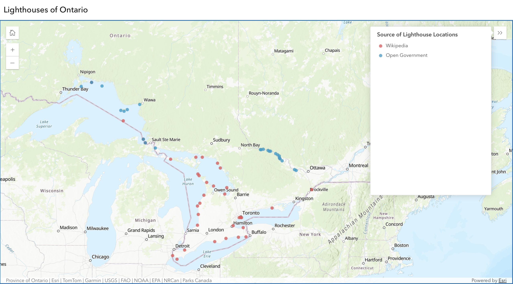

# Ontario Lighthouses

This project is dedicated to collating data on lighthouses located in Ontario, Canada.   
The information has been gathered from various sources, including Wikipedia and official Open Canada databases.

## Project Overview

Ontario is home to many historic and functional lighthouses that play a vital role in maritime navigation.  
This repository aims to provide an organized collection of data regarding these lighthouses, including:

- Names (where available)
- Source
- Locations

## Data Sources

Working on extracting from other sources, currently limited to the following sources:

1. [Wikipedia](https://en.wikipedia.org/wiki/List_of_lighthouses_in_Ontario)
2. [Open Canada](https://ws.lioservices.lrc.gov.on.ca/arcgis2/rest/services/LIO_OPEN_DATA/LIO_Open10/MapServer/14)
